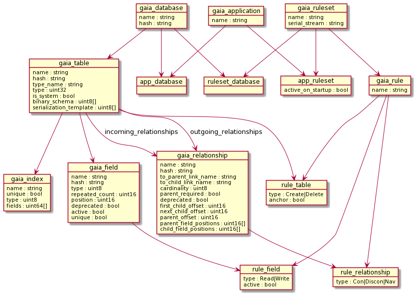

# Gaia Catalog

This directory contains implementation of Gaia data definition language (DDL) and catalog.

## API Usage
Including headers in the following directories, and linking `gaia_catalog` is the most common way to use the catalog library. We recommend using Direct Access APIs to navigate and retrieve catalog records.

- `${GAIA_INC}/gaia/db`
- `${GAIA_INC}/gaia_internal/catalog`

Linking any sub-components of catalog below are also allowed, and may even be necessary in certain scenarios. Use it at your own discretion as the implementation may change more frequently.

## Components

### `src`
This is the source code directory for `gaia_catalog` lib and it contains the following files.

- `catalog` implements all the `gaia_catalog` public interfaces.
- `ddl_executor` is a singleton class that implements all the DDL APIs.
- `fbs_generator` implements FlatBuffers schema (fbs) generation APIs.
- `json_generator` implements FlatBuffers default data (json) generation APIs.
- `gaia_generate` implements Gaia direct access classes (DAC) generation APIs.

### `parser`
This is the scanner-parser for Gaia DDL. We used the lex/parser generator--`flex/bison`--to generate the C++ code for both the lexer and parser. The lexical analysis rules are defined in [`lexer.ll`](parser/src/lexer.ll). The grammar rules are defined in [`parser.yy`](parser/src/parser.yy). A helper or driver class `parser_t` of the lexer-parser is defined in [`gaia_parser.hpp`](parser/inc/gaia_parser.hpp). Most parsing usage should call the `gaia::catalog::ddl:parser_t` instead of the generated `yy_lex` or `yy_parser` interfaces.

Add the following directories to the include list and link `gaia_parser` to use the parser directly.

- `${GAIA_REPO}/production/catalog/parser/inc`
- `${GAIA_PARSER_GENERATED}`

### `gaiac`
This is the catalog command line tool for Gaia data definition language. It is used for bootstrapping the DAC definitions, manual testing and development.

The tool has three modes of operation: loading, interactive, and generation.

By default without specifying any mode, `gaiac` will run under loading mode to execute the DDL statements--translating them into catalog records--without generating any output.

The interactive mode (`--interactive` or `-i`) provides a REPL style command line interface to try out the DDL. The DDL typed in will be executed, and fbs output if any will be printed out to the console output.

Under generation mode (`--generate` or `-g`), the tool will generate the following two header files from specified database(s) under the output path.

- The FlatBuffers header for field access, `<dbname>_generated.h`
- The DAC header file `gaia_<dbname>.h`

With the two headers, a Direct Access source file gains access to the database as defined by the catalog.

Full command line usage can be shown with the `--help` or `-h` option.

#### Examples

Enter interactive mode.

```
   gaiac --interactive

```

Execute DDL statements in `airport.ddl` file, generate header files in the `airport` directory for tables in the `airport` database.

```
   gaiac --generate --db-name airport airport.ddl
```

Execute DDL statements in `incubator.ddl` file. Generate the headers in the `incubator` directory for tables in the `barn_storage` and `lab`databases.

```
   gaiac --db-name barn_storage --db-name lab --generate incubator.ddl
```

Generate catalog Direct Access APIs in the `catalog` directory. This is the command used for bootstrapping.

```
   gaiac --database catalog --generate --output catalog
```

## Databases

The DDL to create database is `create <database_name>`.

To specifying a table in a database, using the composite name of the format `[database].[table]`.

### Examples

A database `addr_book` can be created using the following statement.

```
create database addr_book;
```

Use the following statement to create an `employee` table in `addr_book`
database.

```
create table addr_book.employee (
    name_first: string active,
    name_last: string,
    ssn: string,
    hire_date: int64,
    email: string,
    web: string,
    manages references addr_book.employee
);
```

Switch to a database to make the DDL more succinct (by avoid the database name when referring to a table) with the `use <database_name>` statement. In the following example, the `address` table will be created in the `addr_book`
database.

```
use addr_book;

create table address (
    street: string,
    apt_suite: string,
    city: string,
    state: string,
    postal: string,
    country: string,
    current: bool,
);
```

## Catalog bootstrapping

### Code generation

The DDL executor uses Direct Access Classes to perform operations on the catalog itself. Compiling the `gaia_catalog` requires header files to define the DAC classes that are used. This creates a bootstrapping issue where the original DAC definitions must be generated first. The "code generation" functions require `gaia_catalog.h` and `catalog_generated.h` to exist before they can be compiled.

The current solution to this is to run the `gaiac` utility (which calls functions in the above mentioned files) with `--db-name catalog --generate` to generate the catalog strictly through the DDL executor API. The catalog initialization invokes a function called `bootstrap_catalog()`. To build `gaiac` the first time, a `gaia_catalog.h` was created by hand and `catalog_generated.h` was generated from a handcrafted fbs definition, sufficient for the code generating functions to operate. The `gaia_catalog.h` and `catalog_generated.h` in source control are the ones that were generated by this bootstrapping method.

## Referential integrity check

The relationship metadata needed for referential integrity checks is stored in the `gaia_relationship` catalog table. Catalog records are also subject to referential integrity checks which need the information in the `gaia_relationship` table. The current solution is to hard code the catalog's own relationship information in `type_registry_t::init()` method. This method will populate the cache for referential integrity checks before database records
(including catalog records) are available. After catalog records are available, the cache will be populated lazily from catalog records.

## How to update the core catalog

If the catalog schema is ever updated, it will be necessary to update the `bootstrap_catalog()` method. After the bootstrap function is updated, `gaiac` can be built and run again with `-d catalog -g` parameters to generate the new
`gaia_catalog.h` and `catalog_generated.h`. After this, Gaia production should be rebuilt with the newly generated sources.

Be sure to update [system_table_types.hpp](../inc/gaia_internal/common/system_table_types.hpp) if new types are added or the `type_id` of the catalog tables change.

Be sure to save the new [gaia_catalog.h](../inc/gaia_internal/catalog/gaia_catalog.h) and [catalog_generated.h](../inc/gaia_internal/catalog/catalog_generated.h) in place of the previous ones.

Be sure to check if [catalog_core.hpp](../inc/gaia_internal/db/catalog_core.hpp) or any of the payload FlatBuffers schema files used by it need to be updated.

If there are any references added or removed in catalog schema, the `type_registry_t::init()` method will need to be updated.

### Sequence of core catalog update steps

* Start by only making necessary catalog schema changes to `bootstrap_catalog()`.
  * Add the table type and its ID to [system_table_types.hpp](../inc/gaia_internal/common/system_table_types.hpp).
  * (Optionally) update the `type_registry_t::init()` method when there are reference changes.
* Build `gaiac` only, then execute `gaiac --db-name catalog --generate` in a separate directory (you may need to start the server).
* Copy generated header files:
  * `gaia_catalog.h` to `production/inc/gaia_internal/catalog/`.
  * `catalog_generated.h` to `production/inc/gaia_internal/catalog/`.
  * `gaia_catalog.cpp` to `production/catalog/src/`.
* (Optionally) update `catalog_core.hpp` and related FlatBuffers schema files when necessary.
* Now make changes that leverage the schema changes.
* Build again.

## How to update rule catalog

Non core catalog tables (now, only rule catalog tables), are added using the methods defined in `catalog.hpp`. Mainly the `create_table()` and `create_relationship()` methods.

Currently, the rules catalog tables are created in the method `initialize_catalog()` in `catalog.cpp`. To update or add to these definitions, follow the pattern that is in use.

A CMake target is available perform the following steps automatically. See the [documentation here](https://github.com/gaia-platform/GaiaPlatform/blob/master/production/schemas/system/catalog/CMakeLists.txt#L10).

### Sequence of rule catalog update steps

* After updating `initialize_catalog()`, build `gaiac` only. In a separate directory, run `gaiac --db-name catalog --generate` after making sure the server is running.
* Copy generated header files:
  * `gaia_catalog.h` to `production/inc/gaia_internal/catalog/`.
  * `catalog_generated.h` to `production/inc/gaia_internal/catalog/`.
  * `gaia_catalog.cpp` to `production/catalog/src/`.
  * Rebuild the system.

## Relationships between core tables and other tables

Core catalog tables are built and managed differently than any other tables (rules tables or user-defined) in the database. Because of the complexity of modifying them, it is necessary to create all other tables using the `catalog.hpp` API.

To refer to core tables from within non-core tables, use `gaia_id` values stored in `uint64_t` fields.

The catalog diagram (below) shows solid arrows in the one-to-many direction. Among the 5 core tables, `gaia_database`, `gaia_table`, `gaia_field`, `gaia_relationship` and `gaia_index`, manual relationships are defined. Among all other tables, the solid arrows indicate VLR relationships. The dotted arrows indicate that a "pointer" to a core table row is stored in the other table's row.

## Catalog diagram

This diagram can be rebuilt by copying the text in [catalog.txt](diagram/catalog.txt) and dropping it into the [PlantUML Online Server](https://www.plantuml.com/plantuml/uml/SyfFKj2rKt3CoKnELR1Io4ZDoSa70000).


