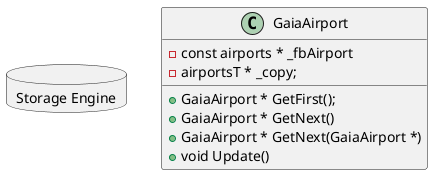
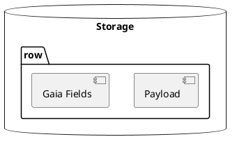
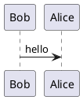

# Data Access API (or lack thereof)
This document provides a technical recommendation for how we expose FlatBuffers to C++ users.  It assumes the reader is familiar with flatbuffers but will offer other architectural details.

## Architecture
The Storage Engine layer is the lowest level of the system.  It defines two types: nodes and edges.  A node defines a record/row/structure.  An edge connects two nodes.  Currently looks like:
```
struct gaia_se_node {
    gaia_ptr<gaia_se_edge> next_edge_first;
    gaia_ptr<gaia_se_edge> next_node_first;
    gaia_id_t id;
    gaia_type_t type;
    size_t payload_size;
    char payload[0];
}
```
The payload in the node is the flatbuffer type.  The flatbuffer is what is materialized for the user. 

The storage engine also defined an edge as follows:
```
struct gaia_se_edge {
        gaia_ptr<gaia_se_node> node_first;
        gaia_ptr<gaia_se_node> node_second;
        gaia_ptr<gaia_se_edge> next_edge_first;
        gaia_ptr<gaia_se_edge> next_edge_second;
        gaia_id_t id;
        gaia_type_t type;
        gaia_id_t first;
        gaia_id_t second;
        size_t payload_size;
        char payload[0];    
}
```

The following diagram shows the relationship between the storage engine, flatbuffers, and user objects.





Nodes and edges are mainpulated through a templated gaia_ptr class which offers methods to traverse the nodes and edges, check nullability, and retrieve the payload.

This document will propose methods for adding syntax on top of the storage engine APIs to make navigation of the user's flatbuffer objects feel natural while still enforcing our copy-on-write and transactional semantics.

## Flatbuffers
As mentioned above, flatbuffers are used as the payload of both gaia nodes and edges.  Here is an abbreviated schema for the openflights data:  airlines, airports, and routes:
```
table airports {
    Gaia_id: int64;

    // rawdata_airports fields
    ap_id: int32;
    iata: string;
    timezone: float;
}

table airlines {
     Gaia_id: int64;

    // regular arline fields
    al_id: int32;
    iata: string;
    active: string;
}

table routes {
    // Later: gaia_e: GaiaPlatform.EdgeFields (required);
    Gaia_id: int64;
    Gaia_Al_id:   int64;
    Gaia_Src_id:  int64;
    Gaia_Dst_id:  int64;

    // rawdata_routes fields
    airline: string;
    al_id: int32 ;
    src_ap: string;
    src_ap_id: int32;
    dst_ap: string;
    dst_ap_id: int32;
    stops: int32;
}
```
## Raw Access
As a first cut, the generated header yields the following structure definitions for the airports table.  (again, this is an abbreviated version)
```
struct airports FLATBUFFERS_FINAL_CLASS : private flatbuffers::Table {
  int64_t Gaia_id() const {
    return GetField<int64_t>(VT_GAIA_ID, 0);
  }
  int32_t ap_id() const {
    return GetField<int32_t>(VT_AP_ID, 0);
  }
  const flatbuffers::String *iata() const {
    return GetPointer<const flatbuffers::String *>(VT_IATA);
  }
  float timezone() const {
    return GetField<float>(VT_TIMEZONE, 0.0f);
  }
  
};
```
There are a few things to note about this generated class:

1. Access of data has to happen through a method so that the data is returned from the correct offset in the buffer.  This is what makes flatbuffers fast, the data is not copied into another structure.
1. There are no setters.  Flatbuffers are not really intended to be modified in place.  The usual paradigm is to change data, create an entirely new flatbuffer and persist this.
1. The class is not inheritable.  I believe this is because the memory layout of sub-class and super class is compiler dependent.  When a flatbuffer is materialized in this no-copy context, it just assumes the offsets will point to the correct place in memory for the data.
1. The string type is a flatbuffers::String as opposed to a std::string or const char *.
1. For non-pointer types (ints, floats) there is no notion of nullability.


### Reading
```
begin_transaction();
  auto node_ptr = gaia_ptr<gaia_se_node>::find_first(kAirportsType);
  const airports * ap = flatbuffers::GetRoot<airports>(node_ptr->payload)
  printf("ap_id: %d, iata: %s\n",
    ap->ap_id(),
    ap->iata()->c_str());
commit_transaction();

```
### Inserting
```
flatbuffers::FlatBufferBuilder& b(128);
b.Finish(CreateairportsDirect(b, node_id, ap_id, iata, timezone));
gaia_se_node::create(node_id, kAirportType, b.GetSize(), b.GetBufferPointer());
```

### Updating
```
flatbuffers::FlatBufferBuilder b(128);
begin_transaction();
  airports * u;
  auto node_ptr = gaia_se_node::open(u->Gaia_Id());
  b.Finish(CreateairportsDirect(b, u->Gaia_Id(), u->ap_id(), u->iata()->c_str(), u->timezone()));
  node_ptr.update_payload(b.GetSize(), b.GetBufferPointer());
commit_transaction();
```
### Deleting
```
```

## Object Access
Here is the object access for the same flatbuffer above:
```
struct airportsT : public flatbuffers::NativeTable {
  typedef airports TableType;
  int64_t Gaia_id;
  int32_t ap_id;
  std::string iata;
  float timezone;
};
```
In contrast to the flatbuffer struct, this struct has the following characteristics:
1. data is accessed directly as properties
1. the properties can be read or set (i.e., this is a mutable object) as expected
1. strings are surfaced as std::string, although this can be modified with the flatbuffer compiler
1. The object (airportsT) is inheritable.  Unpacking to the structure does so by creating a new instance
of airlineT and setting its members.

### Reading
```
begin_transaction();
  auto node_ptr = gaia_ptr<gaia_se_node>::find_first(kAirportsType);
  const airports * ap = flatbuffers::GetRoot<airports>(node_ptr->payload)
  airportsT * obj = ap->UnPack();
  printf("ap_id: %d, iata: %s\n",
    ap->ap_id,
    ap->iata.c_str());
commit_transaction();
```
### Inserting
```
```
### Updating
```
```
### Deleting
```
```


## Mutability

## Nullability



